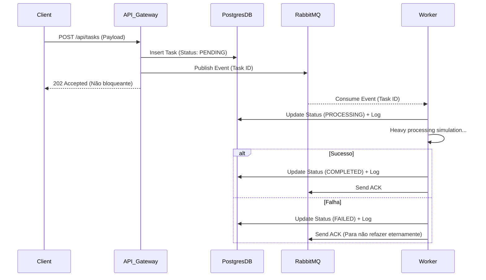

# Distributed Task Processing System


Um sistema distribuído robusto construído com **Node.js**, orquestrando processamento de tarefas em background através de mensageria assíncrona. Desenvolvido com foco em escalabilidade, resiliência e boas práticas de Engenharia de Software.

## 🏗 Arquitetura

O projeto foi desenhado sob o paradigma de **Microservices** em um ambiente de **Monorepo** (utilizando NPM Workspaces). As camadas internas de cada serviço seguem rigorosamente a **Clean Architecture** (SOLID, DRY, KISS, Repository Pattern).

A arquitetura é composta por:
1. **API Gateway**: Porta de entrada principal (REST API em Express). Recebe as requisições (ex: Cadastro de Tarefas), salva rapidamente no banco de dados com status `PENDING` e publica um evento de mensageria, devolvendo um `HTTP 202 Accepted` imediatamente para não bloquear o cliente.
2. **Worker Service**: Microsserviço independente (consumer) que escuta a fila do RabbitMQ. Ele puxa uma tarefa por vez (`prefetch=1`), processa as regras de negócio em background (simulando processos pesados com chance de falha controlada), atualiza o status no banco e gera auditoria (Logs de Tarefas).
3. **Shared / Prisma Layer**: Módulos compartilhados encapsulando os esquemas de banco de dados (ORM) e logs distribuídos (Winston).

## 🔄 Fluxo de Processamento



## 🛠 Tecnologias

- **Linguagem**: TypeScript
- **Backend**: Node.js, Express
- **Banco de Dados**: PostgreSQL, Prisma ORM
- **Mensageria**: RabbitMQ (amqplib)
- **Segurança**: JWT, Bcrypt
- **Validação**: Zod
- **Testes**: Jest
- **Infra/DevOps**: Docker, Docker Compose
- **Observabilidade**: Winston (Logs estruturados)

## 🚀 Como Executar Localmente

### 1. Pré-requisitos
- Node.js (v18 ou v20)
- Docker e Docker Compose instalados

### 2. Instalação e Banco de Dados
Clone o repositório e instale as dependências.
```bash
npm install
```

Suba a infraestrutura base (Postgres e RabbitMQ) através do Docker Compose:
```bash
docker-compose up -d
```

Realize as migrations e gere o client do Prisma, e em seguida compile os pacotes compartilhados:
```bash
npm run db:push --workspace=@task-system/prisma
npm run db:generate --workspace=@task-system/prisma
npm run build
```

### 3. Executando os Serviços
Em um terminal, inicie o **API Gateway**:
```bash
npm run dev --workspace=@task-system/gateway
```
*(Rodando em `http://localhost:3000`)*

Em um segundo terminal, inicie o **Worker**:
```bash
npm run dev --workspace=@task-system/worker
```

## 🧪 Como Testar e Exemplos de Uso

Acesse a interface visual interativa do **Swagger** em `http://localhost:3000/api-docs` após ligar o Gateway, ou utilize os comandos abaixo:

### 1. Criando um Usuário
```bash
curl -X POST http://localhost:3000/api/users/register \
-H "Content-Type: application/json" \
-d '{"name": "Emanuel Oliveira Santos", "email": "teste@email.com", "password": "password123"}'
```

### 2. Fazendo Login (Pegue o Token)
```bash
curl -X POST http://localhost:3000/api/users/login \
-H "Content-Type: application/json" \
-d '{"email": "teste@email.com", "password": "password123"}'
```

### 3. Enviando uma Tarefa (Assíncrona)
Substitua `<SEU_TOKEN>` pelo token recebido:
```bash
curl -X POST http://localhost:3000/api/tasks \
-H "Content-Type: application/json" \
-H "Authorization: Bearer <SEU_TOKEN>" \
-d '{"title": "Processar Fatura 9912", "payload": {"amount": 1500}}'
```

### 4. Depurando o Worker
Observe o terminal onde o Worker está rodando. Ele indicará `📥 Aguardando mensagens`, processará a fatura por 3 segundos e finalizará como `COMPLETED` (ou `FAILED` em simulação de erro de timeout).
No banco de dados, a tabela `TaskLog` conterá todo o rastro de auditoria da tarefa.

## 📂 Estrutura do Projeto

```
/
├── apps/
│   ├── gateway/         # Express API (Clean Architecture, Controllers)
│   └── worker/          # Node Consumer (Lógica de processamento pesado)
├── packages/
│   ├── prisma/          # Schema do DB e migrações
│   └── shared/          # Loggers e tipagens compartilhadas
├── docker-compose.yml   # Infraestrutura de BD e Broker
└── package.json         # NPM Workspace root
```

---
*Desenvolvido por Emanuel Oliveira Santos como demonstração de Arquitetura de Software.*
