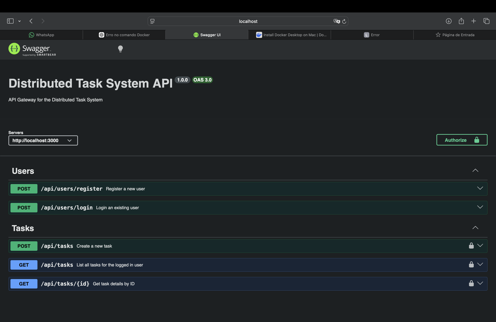
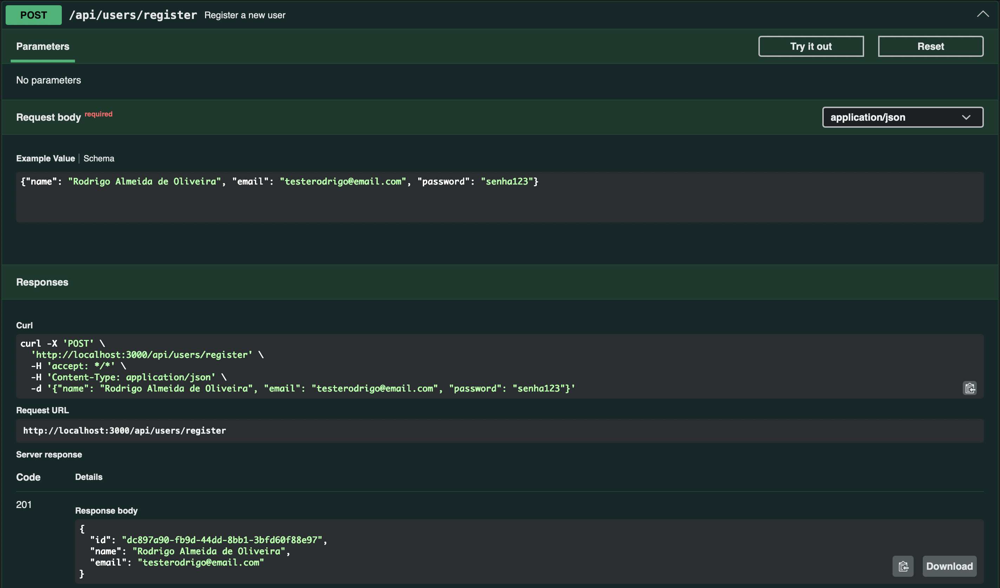
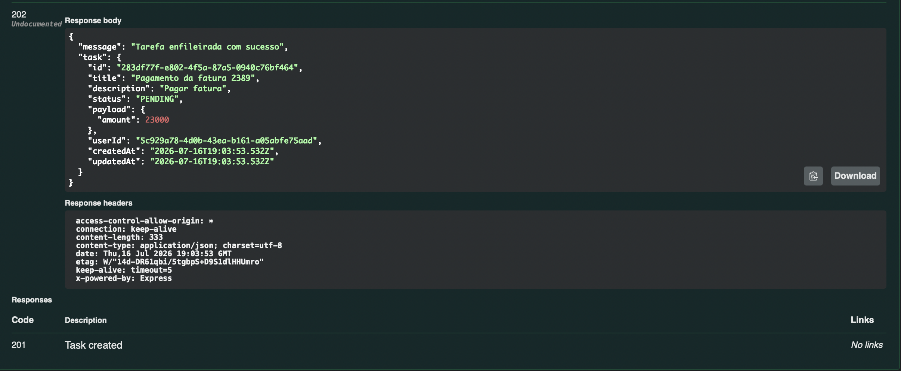
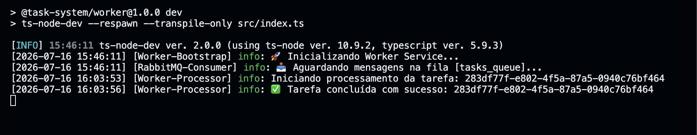

# 🚀 Showcase: Sistema de Processamento Distribuído de Tarefas

Bem-vindo ao **Showcase** do nosso Sistema Distribuído! Este documento foi criado para apresentar as principais funcionalidades, a interface da ferramenta e como as engrenagens funcionam por trás dos panos.

---

## 🎯 O Que a Ferramenta Faz?

Este projeto é um sistema escalável projetado para receber tarefas pesadas dos usuários e processá-las em segundo plano, sem bloquear quem fez a solicitação. 

Imagine que você precise processar uma grande quantidade de relatórios financeiros, processar faturas complexas ou realizar reconhecimento de imagem. Em vez do usuário esperar vários minutos olhando para uma tela de carregamento, o nosso sistema adota a abordagem **assíncrona**:
1. O usuário envia a tarefa.
2. O sistema diz: *"Recebido! Estou trabalhando nisso."*
3. Um processo oculto (*Worker*) assume o trabalho pesado.
4. O usuário pode consultar o status da tarefa a qualquer momento.

---

## 📸 Interface e Uso (Swagger UI)

Toda a interação com o sistema é facilitada por uma interface limpa e documentada interativamente via **Swagger**. É por ela que os desenvolvedores e clientes interagem com a API.

### Tela Principal e Autenticação

### Cadastrando e Logando Usuários
O sistema possui rotas seguras para registro e login. O JWT (JSON Web Token) garante que apenas usuários autenticados consigam disparar novas tarefas.

### Enviando uma Nova Tarefa
Ao enviar uma tarefa, a API responde instantaneamente (Código `201 Created` / `202 Accepted`) com o Status `PENDING`, provando que o usuário não fica bloqueado.

---

## ⚙️ Como Funciona? (Os Bastidores)

Por baixo do capô, adotamos uma arquitetura robusta de microsserviços baseada em **Filas de Mensageria**.

### 1. API Gateway (O Recepcionista)
A primeira barreira do sistema. Construído em **Node.js (Express)**, ele autentica o usuário, grava a intenção no banco de dados (PostgreSQL via Prisma) e envia um *"Aviso de Trabalho"* para o nosso mensageiro.

### 2. RabbitMQ (O Mensageiro)
Usamos o **RabbitMQ** como intermediário (Broker). Ele mantém uma fila extremamente organizada e resiliente de tarefas. Mesmo que o sistema inteiro caia, as mensagens são persistidas e não se perdem.

### 3. Worker (O Operário)
O Worker é um serviço totalmente separado que fica "escutando" a fila do RabbitMQ. 
- Ele puxa as tarefas uma por uma (evitando sobrecarga na memória).
- Muda o status da tarefa no banco de dados para `PROCESSING`.
- Realiza o trabalho pesado e simulado.
- Grava todos os passos em uma tabela de **Logs de Auditoria**, permitindo rastreabilidade total de onde e quando a tarefa passou.
- Atualiza para `COMPLETED` (ou `FAILED`, caso o processamento falhe).

### Logs e Auditoria no Terminal do Worker
O Worker gera logs em tempo real que facilitam a observabilidade e auditoria, provando a natureza assíncrona do fluxo.

---

## 🌟 Principais Benefícios desta Arquitetura

- **Alta Disponibilidade**: Se o Worker cair, o RabbitMQ segura as mensagens até ele voltar.
- **Escalabilidade Horizontal**: O trabalho está lento? Basta ligar 5, 10 ou 100 cópias do "Worker". Todos consumirão a mesma fila cooperativamente, dividindo o peso!
- **Desacoplamento**: O Gateway que atende o usuário e o Worker que processa o dado não se conhecem, eles apenas confiam no RabbitMQ, mantendo o sistema seguro contra falhas em cascata.
